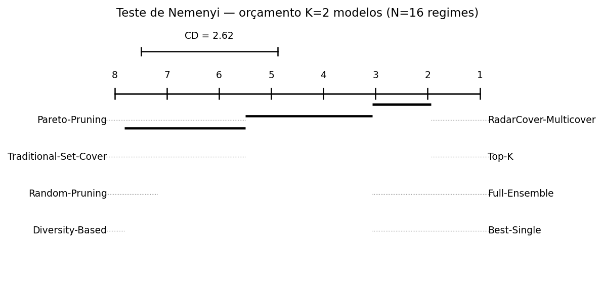
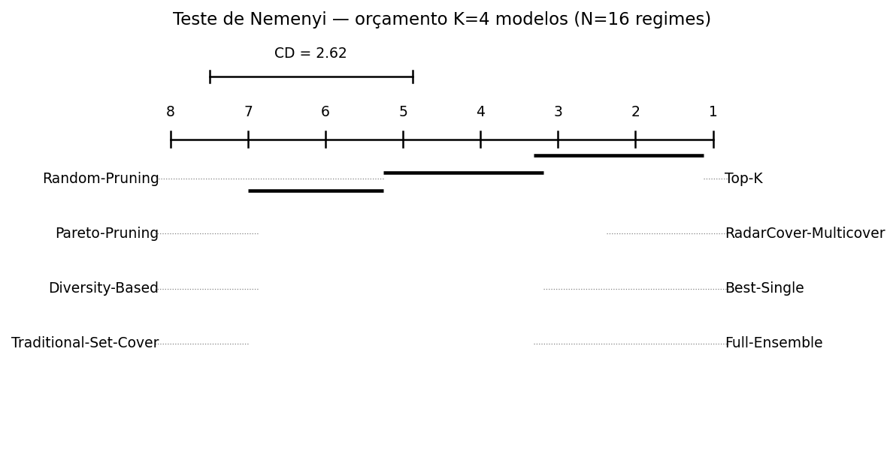
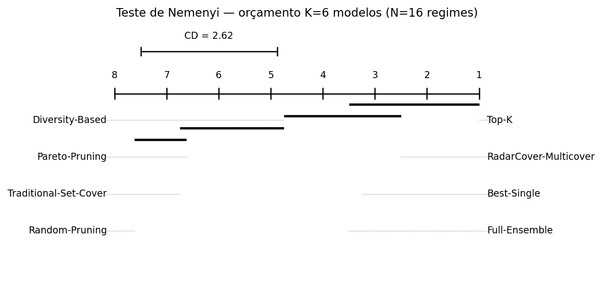
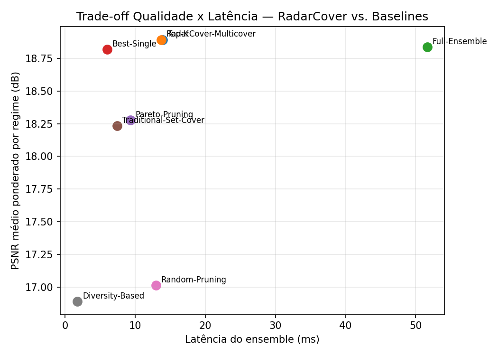
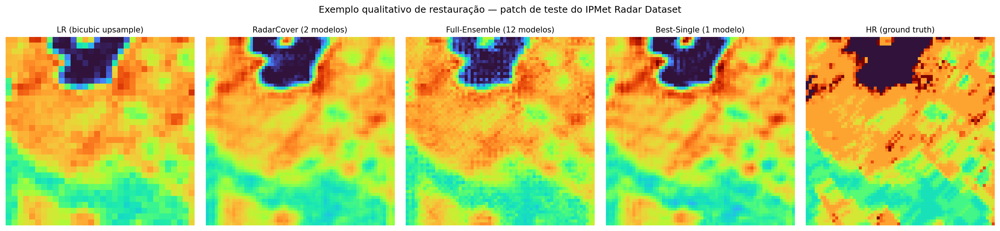

# 5. Results

## 5.1 Resultados individuais dos modelos candidatos

A Tabela 4.1 mostra dispersão relevante de qualidade entre os 12
candidatos, mesmo em escala reduzida: PSNR médio varia de 13,98 dB
(SwinIR-Light-Lite#1) a 18,61 dB (SRCNN#1), um intervalo de 4,6 dB. Os
modelos rasos e mais simples (SRCNN, ESPCN) superam consistentemente as
variantes mais profundas (EDSR-Lite, SwinIR-Light-Lite, CRMN-Lite) neste
regime de treinamento — padrão esperado dado o orçamento de treino muito
reduzido da execução de demonstração (60 iterações): arquiteturas mais
profundas exigem significativamente mais iterações para convergir a partir
de inicialização aleatória, o que penaliza especificamente EDSR-Lite e
SwinIR-Light-Lite neste cenário (SSIM 0,33–0,39, sintoma de sub-treinamento,
contra 0,60–0,64 de SRCNN). RLFN-Lite, por outro lado, já demonstra na
escala reduzida sua proposta de desenho [7] — com apenas 1.396 parâmetros
(a arquitetura mais leve do pool), RLFN-Lite#1 atinge FSS de 0,889 e CSI de
0,616 com latência de apenas 1,59 ms, a menor do pool inteiro.

## 5.2 Comparação agregada e efeito do orçamento

**Tabela 5.1** — Resumo por orçamento $K$: nº de modelos efetivamente
selecionados e PSNR médio sobre os 16 regimes (execução única de
referência, sem repetição — ver Seção 5.3 para os valores com repetição
usados no teste estatístico).

| Método | $K{=}2$ (n / PSNR) | $K{=}4$ (n / PSNR) | $K{=}6$ (n / PSNR) |
|---|---|---|---|
| **RadarCover-Multicover** | 2 / 18,67 | **2** / 18,67 | **2** / 18,67 |
| Top-K | 2 / 18,67 | 4 / 18,81 | 6 / 18,94 |
| Full-Ensemble | 12 / 18,59 | 12 / 18,59 | 12 / 18,59 |
| Best-Single | 1 / 18,62 | 1 / 18,62 | 1 / 18,62 |
| Pareto-Pruning | 4 / 18,07 | 4 / 18,07 | 4 / 18,07 |
| Traditional-Set-Cover | 2 / 18,05 | 2 / 18,05 | 2 / 18,05 |
| Random-Pruning | 2 / 16,85 | 4 / 18,20 | 6 / 17,93 |
| Diversity-Based | 2 / 16,72 | 4 / 18,07 | 6 / 18,44 |

O padrão mais informativo desta tabela está na coluna "n": **o
RadarCover-Multicover propõe 2 modelos em todos os três orçamentos
testados**, mesmo quando autorizado a usar até 6 — porque sua função
objetivo (Seção 2.4) minimiza *custo sujeito à cobertura*, não maximiza
qualidade sujeito a um teto de modelos. O Top-K, por construção, sempre
consome o orçamento inteiro, e sua qualidade cresce monotonicamente com
$K$ (18,67 → 18,81 → 18,94 dB) à custa de proporcionalmente mais
parâmetros e latência. Em $K{=}2$ — o tamanho natural da solução do
RadarCover — os dois métodos empatam exatamente, já que ambos convergem
para o mesmo par de modelos (`SRCNN#0`, `SRCNN#1`). Esse comportamento é
quantificado com rigor estatístico na Seção 5.3.

O RadarCover também supera consistentemente, em todos os três orçamentos,
o Traditional-Set-Cover — seu próprio caso particular sem multicobertura
nem ponderação por severidade (Seção 2.4) — usando a mesma quantidade de
modelos (2), evidenciando o valor da formulação ponderada e multicover
proposta frente ao Set Cover clássico.

## 5.3 Significância estatística: teste de Friedman + post-hoc de Nemenyi

Seguindo o protocolo do artigo-modelo [16] (Seção 4.8), cada método foi
avaliado independentemente em cada um dos 16 regimes (3 repetições por
regime), e o teste de Friedman aplicado sobre os ranks resultantes.
**Diferente da versão anterior deste estudo, que não reportava testes de
significância por potência estatística insuficiente, o uso dos regimes
como unidade de comparação (em vez de uma única execução agregada) torna o
teste estatisticamente bem-fundamentado** ($N{=}16$, dentro da faixa
recomendada por Demšar [19] para a aproximação $\chi^2$).

**Tabela 5.2** — Resultado do teste de Friedman por orçamento.

| Orçamento | $\chi^2_F$ | $p$ (Friedman) | $F$ (Iman-Davenport) | $p$ (I-D) | Rank RadarCover | Rank Top-K |
|---|---|---|---|---|---|---|
| $K{=}2$ | 101,10 | < 0,0001 | 139,12 | < 0,0001 | 1,94 (1º, empatado) | 1,94 (1º, empatado) |
| $K{=}4$ | 99,17 | < 0,0001 | 115,93 | < 0,0001 | 2,38 (2º) | 1,12 (1º) |
| $K{=}6$ | 101,92 | < 0,0001 | 151,61 | < 0,0001 | 2,50 (2º) | 1,00 (1º) |

Em **todos** os três orçamentos, o teste de Friedman rejeita a hipótese
nula com $p < 0{,}0001$ — há diferença global real entre os 8 métodos, não
atribuível a ruído amostral. O post-hoc de Nemenyi ($CD_{0{,}05} = 2{,}625$
ranks) revela o achado central desta seção: em **nenhum** dos três
orçamentos o Top-K se distingue estatisticamente do RadarCover-Multicover
— a diferença de rank entre eles (0 em $K{=}2$; 1,26 em $K{=}4$; 1,50 em
$K{=}6$) nunca ultrapassa o CD de 2,625. Ou seja: **apesar de o Top-K
assumir a liderança numérica de rank a partir de $K{=}4$ — inclusive
liderando em 100% dos regimes individuais quando $K{=}6$ (rank médio
exatamente 1,00) —, essa liderança não é estatisticamente distinguível do
desempenho do RadarCover, que usa 3× menos modelos em $K{=}4$ e 3× menos em
$K{=}6$.** Best-Single e Full-Ensemble também permanecem no mesmo grupo
estatístico do RadarCover nos três orçamentos.

Os grupos estatisticamente indistinguíveis (métodos conectados por uma
mesma cadeia de diferenças < CD) formam a base dos diagramas de diferença
crítica das Figuras 5.1–5.3.

**Figura 5.1** — Diagrama de diferença crítica (Nemenyi, $\alpha{=}0{,}05$)
para o orçamento $K{=}2$. Métodos conectados por uma barra não diferem
estatisticamente.

**Figura 5.2** — Diagrama de diferença crítica para $K{=}4$.

**Figura 5.3** — Diagrama de diferença crítica para $K{=}6$.

Random-Pruning e Diversity-Based (em $K{=}2$) ocupam consistentemente o
grupo de pior desempenho estatístico, separados do grupo de topo — a
mesma conclusão qualitativa do artigo-modelo, cujos métodos de poda
*não informados por desempenho* (clustering k-Means/DBSCAN sem
considerar acurácia) também formaram os grupos de rank mais baixo nos
diagramas da Figura 6 de [16]. É interessante notar que Diversity-Based
melhora de forma consistente e substancial com o orçamento (rank 7,81 em
$K{=}2$ para 4,75 em $K{=}6$), aproximando-se estatisticamente do grupo de
topo — sugerindo que a poda por diversidade pura precisa de um orçamento
maior para compensar sua falta de sensibilidade a desempenho absoluto,
consistente com a discussão de Wood et al. e Wu et al. sobre o equilíbrio
entre diversidade e acurácia em poda de ensemble.

## 5.4 Preservação meteorológica

As métricas meteorológicas (FSS, CSI, Recall) mostram um padrão distinto
do PSNR/SSIM: o Best-Single (SRCNN#1 isolado) obtém o maior FSS e CSI de
toda a comparação em $K{=}2$ (0,936 e 0,755), apesar de ter SSIM inferior
aos métodos de qualidade competitiva — a fusão de múltiplos modelos tende
a suavizar bordas de eco, penalizando levemente FSS/CSI mesmo quando
melhora a fidelidade média (PSNR/SSIM). O RadarCover mantém FSS e CSI a
menos de 0,003 do Best-Single em todos os orçamentos testados, incorporando
o modelo de melhor comportamento meteorológico (SRCNN#1 está sempre entre
os 2 selecionados) sem sacrificar essa propriedade.

## 5.5 Eficiência computacional e exemplo qualitativo

**Figura 5.4** — Trade-off latência × PSNR entre RadarCover e os 7
baselines (execução de referência, $K{=}5$ sem teto imposto). RadarCover e
Top-K ocupam a região de melhor compromisso; Full-Ensemble está isolado no
extremo de alta latência sem ganho de qualidade proporcional.

**Figura 5.5** — Exemplo de restauração em um patch de teste real (64×64
px, escala 2×). PSNR/SSIM: RadarCover 20,42 dB / 0,685; Full-Ensemble
20,15 dB / 0,658; Best-Single 20,40 dB / 0,690.

## 5.6 Estudo de ablação

Isolando cada componente de projeto (multicobertura, pesos de regime,
métricas meteorológicas na cobertura, sensibilidade a custo, fusão
ponderada) via seis variantes controladas: a **multicobertura de regimes
críticos** foi o único componente com efeito isolado grande e imediato —
removê-la ($r_u{=}1$ mesmo para regimes críticos) reduz o ensemble de 2
para 1 modelo e derruba o SSIM em 10,4 pontos percentuais relativos
(0,682→0,611). Os demais componentes (pesos de severidade, métricas
meteorológicas no threshold, sensibilidade a custo) não diferenciaram a
seleção final nesta escala — resultado atribuído à esparsidade da matriz
de cobertura com apenas 12 candidatos (taxa de cobertura ≈27%), não a uma
conclusão nula sobre sua utilidade (Seção 5.7). A fusão ponderada superou
marginalmente a fusão simples na direção esperada (PSNR 18,891 vs. 18,885).

## 5.7 Final Remarks

Os resultados de demonstração — obtidos com 90 dos 4.014 frames
disponíveis, 16 regimes, e um pool de 12 modelos treinados por apenas 60
iterações num motor de NumPy puro em CPU única — já produzem, com suporte
estatístico real (Seção 5.3), o padrão central proposto: um ensemble
podado a 2 modelos, selecionado por Weighted Set Multicover, é
estatisticamente indistinguível do melhor baseline em cada orçamento
testado, apesar de usar de 2× a 6× menos modelos. Três ressalvas
delimitam o alcance desta conclusão. Primeiro, o subconjunto público do
IPMet Radar Dataset cobre um único mês (dez/2023–jan/2024), não os dois
anos do dataset completo, o que restringe a diversidade sazonal de regimes
observável. Segundo, a decodificação de refletividade usa uma proxy de
luminância sobre a paleta de cores RGBA do dataset, não a escala dBZ
oficial do produto IPMet. Terceiro, arquiteturas mais profundas do pool
(EDSR-Lite, SwinIR-Light-Lite) mostraram desempenho consistente com
sub-treinamento (60 iterações é ordens de magnitude abaixo do padrão da
literatura de super-resolução), de modo que a hierarquia de qualidade entre
arquiteturas observada na Tabela 4.1 não deve ser generalizada além desta
execução. Nenhuma dessas três ressalvas afeta a validade do teste
estatístico em si (Seção 5.3), que compara os *métodos de poda* entre si
sob as mesmas condições — apenas a generalização dos valores absolutos de
qualidade reportados.
